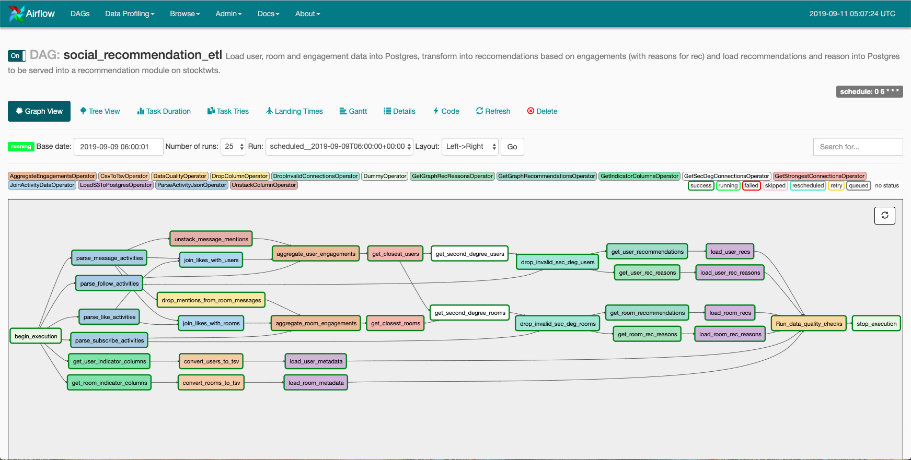
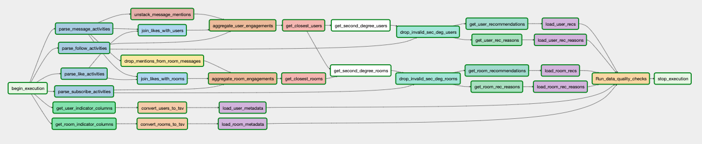

# Stocktwits Graph Based Recommendation ETL

### Data Engineering Capstone Project



#### Project Scope

In this project we develop an ETL pipeline that creates social graph based user and room recommendations to Stocktwits users based on their last week of engagement on the platform. The purpose of the pipeline is to process and store the recommendations and recomendation metadata in a Postgres database that will serve as the backend for a recommendation microservice that will serve recommendations to to the front end client via an API for the user to view. Providing the users with recommendations for who they should follow and what rooms they might enjoy interacting will increase engagement across the platform.

Our pipeline will start from a raw activity data dump and user and room data extracts, process the recommendations along with recommendation reasons (who the user engaged with that lead to the recommendation being made) and store these recommendations in a Postgres database. We will also store data about the users and rooms themselves that can be joined to the recommendations to supplement with additional data or to filter recommendations down.

#### Data Overview

Stocktwits is a social media network for traders and investors. When a user signs up they provide some information about their trading experience, style and preferences. Users gather in topic based rooms to discuss whats going on in the market as it relates to that specifics rooms topic. Users build thier network by following other users and subscribing to rooms. In a room a user can post a message and tag other users in their message. Users can engage with other users message through liking.

Our data consists of user and room meta data extracted for a subset of users from the backend database of the platform. We also have a data dump of 1 weeks worth of activity log data for these users and rooms - including follows, subscribes, messages and likes.

#### Data Exploration

An initial exploration of the data can be found [here](notebooks/ExploratorDataAnalysis.ipynb)

##### Key Takeaways

The metadata extracts are in CSV files. By default Postgres performs a bulk load on files based on tab delineated files so we will need to convert during our ETL. Also each file has a field that consists of a comma separated strings of values (assets_traded for users and topics for rooms) so we will need to be careful when we parse. These fields each contain one or more pieces of categorical data. We may be interested in filtering our recs based on this meta data so we should split this field up into one column for each field which will contain a 1 if that asset_traded/topic is relevant to that user/room and a 0 otherwise.

The activity log is a file of JSON strings. The records have a different schema based on what type of activity the was performed for each record. Since the schema is not uniform we will likely need to parse out all of the events of a specific type into a unique file in order to make this simpler to work with. Additionally we will want to parameterize which activities we base our recommendations off of to makes these more flexibile so we will want to work with each activity type separately. For messages we have a comma separated list of mentioned user ids, we will want to flatten that out when we process our user recommendations. We also notice that we for likes we have the message id of the message that was like but no the room. We will need to infer the room but joining the metadata frorm the message activity in order to see what rooms our users are engaging in in order to make room recommendations.

#### Data Model

The data model is outlined in the SQL schema located [here](sql/create_tables.sql)

We have six tables in total - one for user recomemndations, user recommendation reasons, room recommendations, room recommendation reasons, user meta data and room meta data. Our user and room recommendations have the same schema simply a user_id for whome the rec is for, the id of the recommendation, the weight or score of the recommendation and the timestamp the recommendation was created at. Similarly for the recommendation reasons we have the user_id, rec_id identifer for the rec along with the reason_id which is the user_id of the user that user_id engaged with that led to the recommendation. We have separate tables for users and rooms so that they can be accessed separately in our API without needing any conditionals for the type of recommendation. We create a primary key on user_id and rec_id for identification purposes. 

The user metadata table contains the user_id as the primary key along with string metadata for username, expierience, approach, and holding period. In our raw data our assets_traded field is a comma separated list of strings. To handle this in our data model we break this down several fields that each represent an asset class that will contain a 1 if the user indicated that they trade that asset class and a 0 otherwise. These asset indicator fields can be used to efficiently filter our recommendations down in our API based on assets that the recommended user likes to trade.

The rooms metadata table contains the room_id as the primary key along with string metadata for slug (room name). In our raw data our topics field is a comma separated list of strings. To handle this in our data model we break this down several fields that each represent a topic that will contain a 1 if the room is tagged with that topic and a 0 otherwise. These topic indicator fields can be used to efficiently filter our recommendations down in our API based on topics of the recommended rooms.

#### Data Pipeline



##### Pipeline Explaination

The pipeline consists of two main paths - metadata processing and loading and recommendation processing and loading, each applied to two different domains - users and rooms. Airflow is a great tool for a job like this since tasks in these paths can run in parallel. Note that all intermediary tasks prior to loading into postgress use S3 as intermediary data lake storage. Each opperator in our pipeline treats the input as immutable, thus the output of each opperator that doesn't load data into postgres creates a new data file in S3.

The metadata path is fairly straight forward. First we break down our comma separated categorical fields with the `GetIndicatorColumnsOperator` opperator. Next we convert the csv files that to tsv files with the `CsvToTsvOperator` since our airflow PostgresHook assumes tsv format for the bulk load opperation. Finally we go ahead and load the meta data files into postgres with the `LoadS3ToPostgresOperator`.

The recommendation path is way more complicated. Event though we have two recommendation paths - one for users and one for rooms - these start out with some shared ETL that is necesary for both. Our activity data is in a JSON log with mixed events with different schmea. We first parse out unique activity data for follows, subscribes, messages and likes using the `ParseActivityJsonOperator`. This results in a uniform schemaed tsv file for each activity type. From here we need to do some clean up. Starting with the emssages data, we need to first unroll the comma separated mention_ids field in the message data to unique mention events for user to user engagmentes and we do this with the `UnstackColumnOperator`. We also want to get a relationship of user to room engagements by just looking at the user_id who posted a message and the room_id it was posted in. We drop the columns and save the result in a new tsv file using the `DropColumnOperator`. Next we need to associate like events with user to user and user to room engagements. Our like data associates a user to a message so we have two tasks that use the `JoinActivityDataOperator` to join the like data with the message data and pull out the user to user engagement between the liker and the author of the message and the user to room engagment between the liker and the room the message was posted in.

With the shared ETL done, the recommendation pipelines become a bit more linear now. We aggregate together all of the user to user and user to room engagements, respectively, in an egagement table that can be thought of as a graph (each engagment pair are nodes with an edge in betweem) with the `AggregateEngagementsOperator`. From here we use the `GetStrongestConnectionsOperator` to calculate the 10 closest users and rooms for each user, i.e. the users and rooms that they engaged with the most. Now that we have the closest 1st degree connections we use the `GetSecDegConnectionsOperator` to get the closes 2nd degree user connections by joining the closest users on themselves and the 2nd degree room connections by joining the closest rooms on the closest users. Our two recommendations paths become interdependent at this step because we need both the closest users and the closest rooms for the room recommendations. These 2nd degree connections essentially serve as candidated for our recommendations but we need to validate them first. We remove any 2nd degree connections that the user is already connected to (follows user or subscribed to room) with the `DropInvalidConnectionsOperator`. From here we simply aggregate the strength of the second degree connection and take the strongest ones to use for our recs. We perform the `GetGraphRecommendationsOperator` and `GetGraphRecReasonsOperator` in parallel for both our user recs and graph recs to get the actual recommendations and track the first degree connections that lead us to the recommendations to be able to display as reasons for the recommendation to the end user when the recs are served on the frontend. Finally, once we have these tsv files saved our we use the same `LoadS3ToPostgresOperator` introduced in the metdata path to load the data into postgres.

Once all of the tables are succesfully loaded into postgres we use the `DataQualityOperator` to perform some quality checks on the data. We go into more detail on this below.

##### Data Quality Checks

In our datapipe we included a `DataQualityOperator` that can run arbirarty checks against queries that count records by simply passing in the query and the expected result. Here is how we call it in our dag.

```
run_quality_checks = DataQualityOperator(
    task_id='Run_data_quality_checks',
    postgres_conn_id='dev_postgres',
    test_cases=[
        ("SELECT COUNT(user_id) from user_recs WHERE user_id IS NULL OR rec_id IS NULL", 0),
        ("SELECT COUNT(user_id) from user_rec_reasons WHERE user_id IS NULL OR rec_id IS NULL", 0),
        ("SELECT COUNT(user_id) from room_recs WHERE user_id IS NULL OR rec_id IS NULL", 0),
        ("SELECT COUNT(user_id) from room_rec_reasons WHERE user_id IS NULL OR rec_id IS NULL", 0),
        ("SELECT COUNT(id) FROM users", 5000),
        ("SELECT COUNT(id) FROM rooms", 1000)
    ],
    dag=dag
)
```

We are running a total of 6 quality checks. Our first four checks verify that there are no records in any of our recommendations or recommendation reasons that have no user_id or rec_id. The last two verify that the number of records in our users and our rooms tables matches what we expect based on our explorator data analysis.

##### Data Dictionary

The data dictionary can be found [here](data_dictionary/README.md).

#### Capstone Writeup

##### Choice of Tools

For our social recommendation ETL job we chose to utilize S3 for a data lake, Postgres for our database and airflow for ETL orchestration. S3 is the perfect tool for scalable storage to use to pass data between different parts of our processing pipeline. 

We opted for a relational data model because we have a psuedo fact and dimensional model to our data. I say psuedo because we don't have fact and dimension in the traditional business analytics sense but we have a core piece of data that we care about (a recommendation) and then we have other meta data or additional data that we could potentially want to augment that information with (usernames, room names, recommendation reasons, etc.). We opted for Postgres since we are serving individual rows of our data to the end user via an API. Redshift is a MPP database that is best suited for handling queries that aggregate large amounts of data via funcitons like GROUP BYs and we dont have this access pattern here. This makes Postgres a much better tool given our access patterns to the data. 

Airflow is the natural choice for ETL orchestration. We know we have a job that has a lot of subtasks and that we want to run on a schedule. Airflow gives us the flexability to break our pipeline down into modular chunks that are easier to monitor, maintain and debug. The custom operators give us the the ability to extend Airflows cababilities to better suit our needs and additionally allow us to build data quality checks in first hand.

##### Updating the Data

This ETL will run daily to provide updated recommendations based on a trailing week of activity data. This pipeline assumes that there is another ETL job that dumps the user, room and activity data into S3 at the end of each night in order to run the updated social recommendation ETL job.

##### Addressing Additional Scenarios

> *The data was increased by 100x.*  
> 
> If the data was increased by 100x we would  consider updating this ETL job to process the recommendations using a Spark cluster instead of using python and pandas. This should enable us to process a larger amount of data more efficiently. I dont think we would consider updating our database to Redshift since we are servering individual rows of our recommendation tables to the end user and not really aggregating data into OLAP cubes. We would probably need to scale up our Postgres instance/cluster.

> *The pipelines would be run on a daily basis by 7 am every day.*  
> 
> This pipeline already runs once a day at 6AM UTC. To update this to run at 7AM UTC we would simply update the cron schedule in the airflow dag config.

> *The database needed to be accessed by 100+ people.*  
> 
> Since the data is being served directly to the end user via an API, it is possible - though extremely unlikely - that all 10,000 of our users perform actions on the site at the same time. The responsibility of making sure we can handle this type of load gets delegated to our API and our Postgres instance. We need to build out API to handle concurrency and we need to make sure we have our Postgres instance configured correctly to handle this as well. Using a managed version of Postgres vis AWS RDS may be a good option since we don't have to worry about some of these details of the database ourselves.